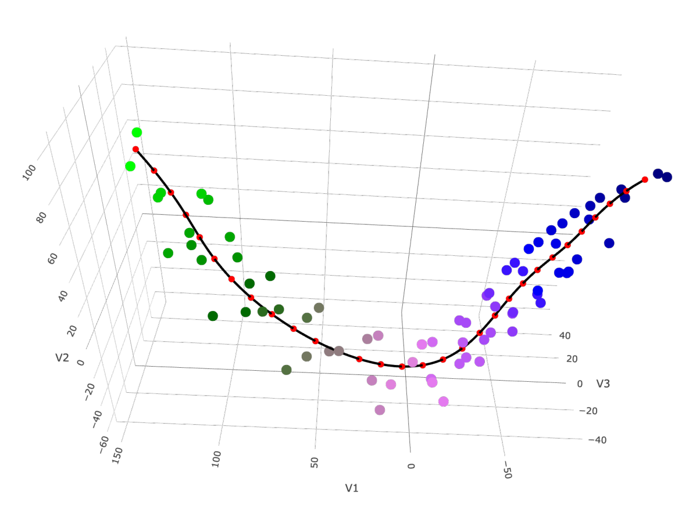

<!-- README.md is generated from README.Rmd. Please edit that file -->

```{r, include = FALSE}
knitr::opts_chunk$set(
  collapse = TRUE,
  comment = "#>",
  fig.path = "man/figures/README-",
  out.width = "100%"
)
```

# MPhS
<!-- badges: start -->
<!-- badges: end -->

<table style="border-collapse: collapse; width: 100%;">
  <tr>
    <td style="border: 1px solid transparent; padding: 8px;">
    With the `MPhS` package, the user can map their transcriptomic dataset onto the Molecular Phenology Scale (MPhS) proposed by

    Tornielli GB, Sandri M, Fasoli M, Amato A, Pezzotti M, Zuccolotto P, Zenoni S (2023) 
    A molecular phenology scale of grape berry development. Horticulture Research, Volume 10, Issue 5:uhad048.
    <a href="https://academic.oup.com/hr/article/10/5/uhad048/7077841">doi:10.1093/hr/uhad048</a>
    </td>
    <td style="border: 1px solid transparent; padding: 8px;">
      
    </td>
  </tr>
</table>


## Introduction

The molecular phenology scale (MPhS) represents a new tool to precisely align time-series of fruit samples on the basis of molecular changes and to quantify their transcriptomic distance. <br>
The MPhS was built by exploiting molecular-based information from several grape berry transcriptomic datasets. <br>
The proposed statistical pipeline consists of an unsupervised learning procedure yielding an innovative combination of semiparametric, smoothing, and dimensionality reduction tools. <br>
The MPhS is a complementary method for mapping the progression of grape berry development with higher detail compared to classic time- or phenotype-based approaches, and could help coping with challenges such as those raised by climate change.


## Installation

You can install the development version of MPhS from [GitHub](https://github.com/sndmrc/MPhS) with:

``` r
# install.packages("pak")
pak::pak("sndmrc/MPhS")
```

## Example

This is a basic example that shows you how to map the `RPKMdata` dataset (included in the package) onto the MPhS.

Load libraries and data.
```{r step0, results="hide", warning=FALSE, message=FALSE}
library(MPhS)
library(tidyr)
library(dplyr)
data("RPKMdata")
```

Preprocess data: create variables representing the experimental conditions and a variable that defines the maturation stage.
```{r step1, results="hide", warning=FALSE, message=FALSE}
exp_cond <- names(RPKMdata)[-1]
genes <- RPKMdata$gene_id
dts_vars <- data.frame(exp_cond) %>%
   separate(exp_cond, into=c("Cultivar", "Stage", "Replicate"), sep="_")
```

Transpose the gene expression matrix and add the newly derived variables.
```{r step2, results="hide", warning=FALSE, message=FALSE}
dts <- t(RPKMdata[, -1])
dts <- cbind(dts, dts_vars)
names(dts) <- c(genes, names(dts_vars))
```

For each stage and each cultivar, calculate the mean value of the 3 replicates (it can takes several minutes).
```{r step3, results="hide", warning=FALSE, message=FALSE}
dts_means <- dts %>%
   group_by(Cultivar, Stage) %>%
   summarize(across(all_of(genes), mean))
```

Map data onto the transcriptomic scale using the `MPhStimepoints` command.
```{r step4, results="hide", warning=FALSE, message=FALSE}
MPhS_out <- MPhStimepoints(data=dts_means, strata_var="Cultivar", stage_var="Stage")
```

The `MPhS_out` object can be used to visualize the position of the samples on the transcriptomic scale.
```{r plot, results="hide", warning=FALSE, message=FALSE}
p <- plot(MPhS_out)
print(p)
```

