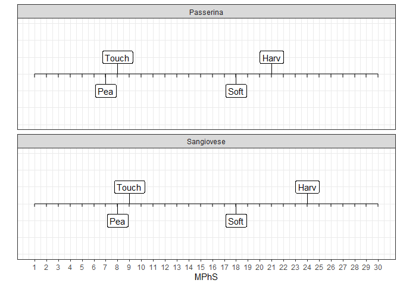

<!-- README.md is generated from README.Rmd. Please edit that file -->

# MPhS

<!-- badges: start -->
<!-- badges: end -->

With the `MPhS` package, the user can map their transcriptomic dataset
onto the Molecular Phenology Scale (MPhS) proposed by

Tornielli GB, Sandri M, Fasoli M, Amato A, Pezzotti M, Zuccolotto P,
Zenoni S (2023) A molecular phenology scale of grape berry development.
Horticulture Research, Volume 10, Issue 5:uhad048.
[doi:10.1093/hr/uhad048](https://academic.oup.com/hr/article/10/5/uhad048/7077841)

## Installation

You can install the development version of MPhS from
[GitHub](https://github.com/sndmrc/MPhS) with:

``` r
# install.packages("pak")
pak::pak("sndmrc/MPhS")
```

## Example

This is a basic example that shows you how to map the RPKMdata dataset
(included in the package) onto the MPhS.

``` r
# Load libraries and data
library(MPhS)
library(tidyr)
library(dplyr)
#> 
#> Attaching package: 'dplyr'
#> The following objects are masked from 'package:stats':
#> 
#>     filter, lag
#> The following objects are masked from 'package:base':
#> 
#>     intersect, setdiff, setequal, union
data("RPKMdata")

# Preprocess data
# Create variables representing the experimental conditions and 
# a variable that defines the maturation stage.
exp_cond <- names(RPKMdata)[-1]
genes <- RPKMdata$gene_id
dts_vars <- data.frame(exp_cond) %>%
   separate(exp_cond, into=c("Cultivar", "Stage", "Replicate"), sep="_")

# Transpose the gene expression matrix and add the newly derived variables.
dts <- t(RPKMdata[, -1])
dts <- cbind(dts, dts_vars)
names(dts) <- c(genes, names(dts_vars))

# Now, for each stage and each cultivar, calculate the mean value of the 3 replicates.
dts_means <- dts %>%
group_by(Cultivar, Stage) %>%
summarize(across(all_of(genes), mean))
#> `summarise()` has grouped output by 'Cultivar'. You can override using the
#> `.groups` argument.

# Map data onto the transcriptomic scale
MPhS_out <- MPhStimepoints(data=dts_means,
strata_var="Cultivar", stage_var="Stage")
```

You can also embed plots, for example:


